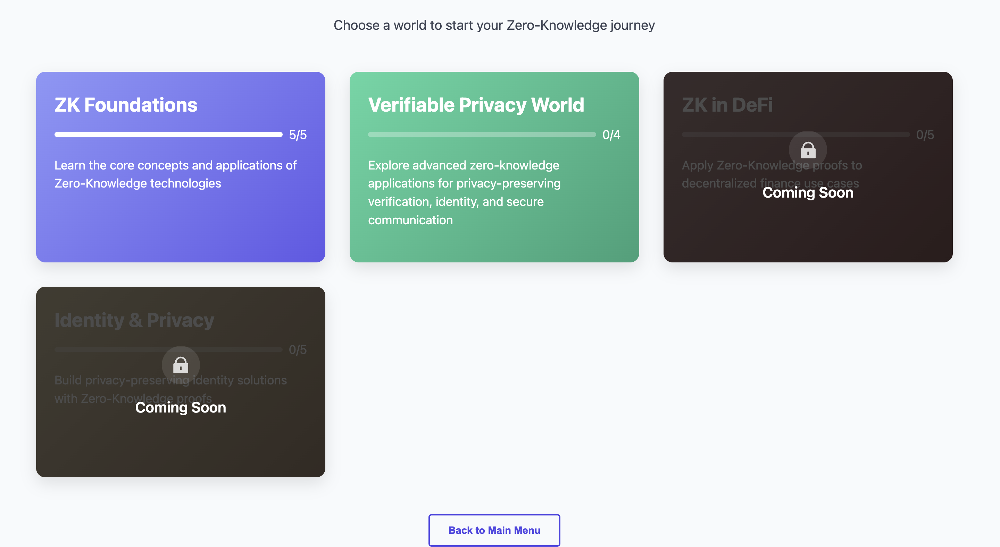

# ZK Card Game

An educational card game focused on Zero-Knowledge technologies. Play on : https://zk-cards.netlify.app/



## Overview

ZK Card Game is an interactive card game that teaches users about Zero-Knowledge technologies through practical challenges. Players solve real-world privacy and verification scenarios by selecting and applying appropriate ZK technology cards.

## Features

- **Educational Gameplay**: Learn about various ZK protocols, tools, and applications
- **Card-Based Strategy**: Use different ZK technology cards to create solutions
- **Scenario Challenges**: Solve privacy and verification challenges
- **Interactive Interface**: Drag-and-drop card placement
- **Learning Feedback**: Get educational feedback on your solutions

## Tech Stack

- **Frontend**: React with JavaScript
- **Build Tool**: Vite
- **State Management**: Zustand
- **Assets**: SVG graphics for cards and UI elements

## Project Structure

- `src/components/`: React components for game screens
- `src/store/`: Zustand state management
- `src/data/`: Game data (cards, scenarios)
- `src/hooks/`: Custom React hooks
- `src/assets/`: SVG and image assets
- `src/utils/`: Utility functions

## Getting Started

### Prerequisites

- Node.js 18.x or higher
- npm 9.x or higher

### Installation

```bash
# Clone the repository
git clone https://github.com/zk-card/zk-cards.git
cd zk-cards

# Install dependencies
npm install

# Start development server
npm run dev
```

Visit `http://localhost:5173/` to see the application in your browser.

### Build for Production

```bash
npm run build
```

## Game Screens

1. **Main Menu**: Entry point with play, tutorial, and about options
2. **World Selection**: Choose a world of scenarios
3. **Scenario Selection**: Choose a specific challenge to solve
4. **Gameplay Screen**: Solve challenges by placing ZK technology cards
5. **Tutorial**: Learn how to play the game
6. **About**: Information about the game and ZK technologies

## Contributing

This project is in MVP phase. Contributions are welcome!

## License

[Apache License](LICENSE)

## Acknowledgements

- This project is educational in nature
- All Zero-Knowledge technologies mentioned are real and used for educational purposes